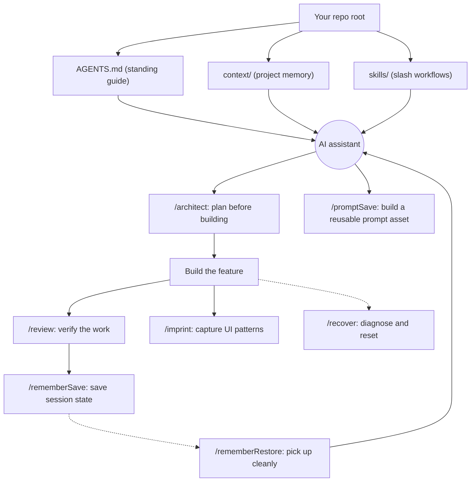

# Practical AI Playbook

This is a drag-and-drop playbook for building software with AI.

It is not a framework, package, or tool install. It is a small set of project files that help an AI assistant understand the project, follow the same working rules every time, and use repeatable slash-skill workflows.

## Quickstart

1. Copy `AGENTS.md`, `context/`, and `skills/` into your project root.
2. Fill in the `[PLACEHOLDER]` tokens in `AGENTS.md` and only the `context/` templates your project needs (see [Project Profiles](#project-profiles)).
3. Tell your AI assistant: "Read `AGENTS.md` and `context/` before planning or making changes."

That is the whole setup. From here the AI follows the same working rules every session, and you can call the slash skills (`/architect`, `/review`, `/rememberSave`, and the rest) whenever the moment calls for one.

## Drop Into Any Project

Add these to the root of your project:

- `AGENTS.md`
- `context/`
- `skills/`

Then fill in the placeholders in `AGENTS.md` and the files in `context/` with that project's actual goals, architecture, standards, constraints, current plan, and progress.

## What Each Part Is For

- `AGENTS.md` is the project-facing agent guide. Fill in its placeholders so it reads like it belongs to the project you dropped it into.
- `context/` is the project memory. It explains what the project is, how it is structured, what rules matter, and what is currently happening.
- `skills/` is the workflow library. Each slash command points to a matching `skills/<name>/SKILL.md` file.
- `integrations/` contains optional tool-specific layouts for Claude Code, Codex, and Cursor.
- `memory.md` is the per-session handoff file written by `/rememberSave` in the project root. It is transient session state, distinct from `context/progress-tracker.md`, which holds durable project status. It appears once you first save memory.

The README is for humans. `AGENTS.md` is the reusable agent guide the AI reads while working.

## How It Fits Together

You drop in three folders. The AI reads `AGENTS.md` and `context/` as its source of truth, then the slash skills wrap each moment of the build lifecycle.



## Standards vs Templates

The files in `context/` come in two kinds. Knowing which is which saves time:

- **Use-as-is standards** (no editing required): `context/code-standards.md`, `context/data-standards.md`, `context/ai-standards.md`, and `context/ai-workflow-rules.md`. They work immediately. Only edit one if a project rule differs from what it says.
- **Fill-in templates** (project memory, full of `[PLACEHOLDER]` tokens): `AGENTS.md`, `context/project-overview.md`, `context/architecture.md`, `context/build-plan.md`, `context/progress-tracker.md`, `context/library-docs.md`, `context/ui-rules.md`, and `context/ui-registry.md`. Replace the placeholders with your project's real details, or mark a file `not applicable` if your project does not need it.

You do not need every template for every project. See [Project Profiles](#project-profiles) for which files each kind of project actually needs.

## Skill Commands

Use these in your AI chat when the moment calls for a specific workflow:

| Command | Use it when |
| ------- | ----------- |
| `/architect` | You want to think through a feature before building. |
| `/review` | You want to check completed work before moving on. |
| `/rememberSave` | You are ending a session and want to preserve handoff context. |
| `/rememberRestore` | You are starting a new session and want to pick up cleanly. |
| `/recover` | Repeated fixes are making the work worse. |
| `/imprint` | UI work created a reusable pattern that should stay consistent. |
| `/promptSave` | You want to design, optimize, and document a prompt or GPT as a reusable asset. |

If your AI tool supports slash skills, it can treat these as commands. If it does not, use the same slash text anyway; it tells the AI to read the matching file in `skills/` and follow it.

## How To Use It

1. Drop the playbook files into a project.
2. Fill in the relevant `context/` templates.
3. Ask the AI to read `AGENTS.md` before planning or changing code.
4. Use slash skills for planning, review, memory, recovery, and UI consistency.
5. Keep `context/` updated when decisions, architecture, standards, or progress change.

## Project Profiles

Not every project needs every file. The use-as-is standards always come along (they cost nothing to keep), so the only real question is which templates you fill in. Use the profile closest to your project, then adjust.

### Full AI application (UI + AI + data + API)

- **Fill these templates:** all templates
- **Standards that apply:** code, data, ai, workflow
- **Skip:** none

### Internal web app or dashboard (light or no AI)

- **Fill these templates:**
  - `project-overview`
  - `architecture`
  - `build-plan`
  - `progress-tracker`
  - `library-docs`
  - `ui-rules`
  - `ui-registry`
- **Standards that apply:** code, workflow (data if data-backed)
- **Skip:** `ai-standards` if no model use

### Data analysis, visualization, or notebook

- **Fill these templates:**
  - `project-overview` (light)
  - `progress-tracker`
  - `library-docs`
- **Standards that apply:** code, data, workflow (ai if using models)
- **Skip:** `architecture`, `build-plan`, `ui-rules`, `ui-registry`

### API or automation script (small)

- **Fill these templates:**
  - `AGENTS.md` (light)
  - `progress-tracker` (optional)
- **Standards that apply:** code, workflow
- **Skip:** `architecture`, `build-plan`, `ui-rules`, `ui-registry`, `data`, `ai` unless relevant

### Prompt or GPT asset

- **Fill these templates:**
  - `AGENTS.md` (light)
  - `project-overview` (light)
- **Standards that apply:** ai, workflow
- **Skip:** `architecture`, `build-plan`, `ui-rules`, `ui-registry`, `data`

Rule of thumb: keep all the standards files, fill only the templates your project actually needs, and mark the rest `not applicable` (or delete them). The Prompt or GPT asset profile leans on the `/promptSave` skill; the AI application and web app profiles use the UI skills like `/imprint`.

## Tool Integrations

The base playbook is plain Markdown. For tools with their own discovery folders, copy the matching integration into the project root after adding `AGENTS.md`, `context/`, and `skills/`.

### Claude Code

Copy:

```text
integrations/claude/.claude/
integrations/claude/CLAUDE.md
```

Into:

```text
<project-root>/.claude/
<project-root>/CLAUDE.md
```

Claude Code project skills live at `.claude/skills/<skill-name>/SKILL.md`. The `CLAUDE.md` file imports `AGENTS.md` so Claude Code reads the shared guide and context as its source of truth.

### Codex

Copy:

```text
integrations/codex/.agents/
```

Into:

```text
<project-root>/.agents/
```

Codex repo skills live at `.agents/skills/<skill-name>/SKILL.md`. Codex reads root `AGENTS.md` directly, so no extra routing file is needed.

### Cursor

Copy:

```text
integrations/cursor/.cursor/
```

Into:

```text
<project-root>/.cursor/
```

Cursor uses project rules at `.cursor/rules/*.mdc`. These rules route Cursor to the shared `AGENTS.md`, `context/`, and `skills/` files. Cursor also reads root `AGENTS.md` directly for straightforward project instructions.

### Keeping Integrations In Sync

The base `skills/` folder is the source of truth. The Claude and Codex integrations contain copies of each `SKILL.md`, so when you change a skill, update the matching copy under `integrations/claude/.claude/skills/` and `integrations/codex/.agents/skills/` as well. To avoid drift entirely, you can instead symlink those skill folders to the base `skills/` folder; both Claude Code and Codex follow symlinks when discovering skills.

## How This Should Feel

This playbook should not feel like busywork. It should make AI-assisted work clearer, calmer, and less likely to drift.

The docs are the source of truth. The skills are the repeatable workflows. Everything is plain Markdown, so the playbook stays portable and reusable.
