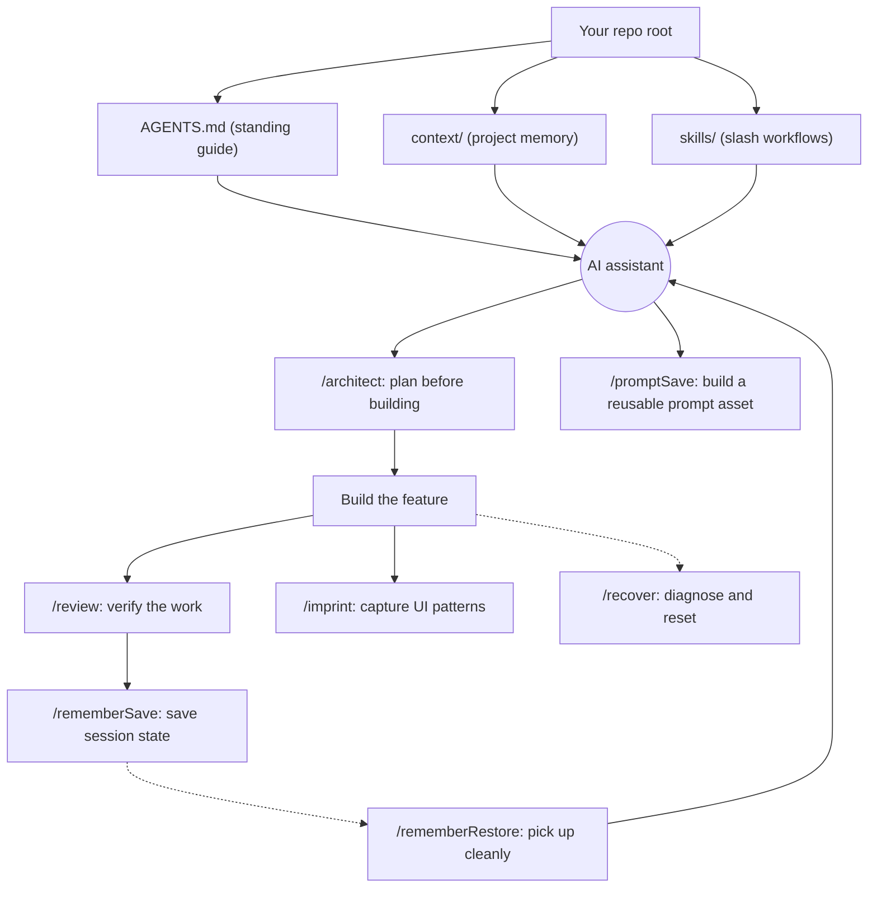

# Practical AI Playbook

This is a practical, drag-and-drop playbook for creating software with AI (that won't burn through your entire token budget). It’s not some fancy framework or 10x toolchain; it’s just a small set of project files that will help your AI assistant understand exactly what you want to build.

## Getting Started

1. Copy `AGENTS.md`, `context/`, and `skills/` into your project root.
2. Fill in the `[PLACEHOLDER]` tokens in `AGENTS.md` and only the `context/` templates your project needs (see [Project Profiles](#project-profiles)).
3. Tell your AI assistant: "Read `AGENTS.md` and `context/` before planning or making changes."

It might not seem like a lot, but that's all you need to do. Your AI assistant will now follow the same working rules every session, and you can call the "slash skills" (`/architect`, `/review`, `/rememberSave`, etc.) whenever you need to.

If you're a seasoned pro, or have prior experience with AI-assisted development, feel free to skip the rest of this guide and start building.

That said, if you're new to coding with AI, or just want to know more about how this all works, I encourage you to keep reading.

## What Each Part Does

- `AGENTS.md` is the project-facing agent guide. Fill in its placeholders so it reads like it the primary spec guiding development.
- `context/` is the project's memory. It explains what the project is, how it is structured, what rules matter, and what is currently happening.
- `skills/` is the workflow library. Each slash command or skill points to a matching `skills/<name>/SKILL.md` file.
- `integrations/` contains optional tool-specific layouts for Claude Code, Codex, and Cursor (if you use them).
- `memory.md` is a transient handoff file created in the project root by `/rememberSave`. It is separate from the `context/progress-tracker.md` file which tracks overall project status. This file is created the first time you save session memory.

## How It Fits Together

The `AGENTS.md` file and `context/` folder work in tandem as a single, comprehensive source of truth. This combined guidance tethers the actions of your AI assistant to the task at hand while reducing token usage. The slash skills are theoretically unneccessary for successful implementation, but they're extremely helpful for dealing with (or even outright preventing) hallucinations, drift, and other common issues associated with AI workflows.



## Standards vs Templates

The files in `context/` come in two distinct flavors. Knowing which is which will save you time (and tokens):

- **Use-as-is standards** (no editing required): `context/code-standards.md`, `context/data-standards.md`, `context/ai-standards.md`, and `context/ai-workflow-rules.md`. These work broadly and immediately, but can be tailored to fit your project's specific governance needs.

- **Fill-in templates** (project memory, full of `[PLACEHOLDER]` tokens): `AGENTS.md`, `context/project-overview.md`, `context/architecture.md`, `context/build-plan.md`, `context/progress-tracker.md`, `context/library-docs.md`, `context/ui-rules.md`, and `context/ui-registry.md`. Replace the placeholders with your project's real details. Try to balance specificty with directness, but it's always better to be too detailed than not detailed enough.

It's worth noting that you DO NOT need every template for every project. See the [Project Profiles](#project-profiles) section for more information on which files each project example actually needs.

## Skill Commands

Use these slash skills in your AI chat when the moment calls for a specific workflow:

| Command | Use it when |
| ------- | ----------- |
| `/architect` | You want to think through a feature before building. |
| `/review` | You want to check completed work before moving on. |
| `/rememberSave` | You are ending a session and want to preserve handoff context. |
| `/rememberRestore` | You are starting a new session and want to pick up cleanly. |
| `/recover` | Repeated fixes are making the work worse. |
| `/imprint` | UI work created a reusable pattern that should stay consistent. |
| `/promptSave` | You want to design, optimize, and document a prompt or GPT as a reusable asset. |

If your AI tool supports slash skills, it can treat these as commands. If it does not, use the same slash text anyway; this will directly tell the AI to read the matching file in `skills/` and follow it's instructions.

## Quick Review

Before moving on to the project templates, let's recap everything we've covered so far:

1. Drop the playbook files into your project.
2. Fill in the relevant `context/` templates.
3. Ask the AI to read `AGENTS.md` and `context/` before planning or changing code.
4. Use slash skills for planning, review, memory, recovery, and UI consistency.
5. Keep `context/` updated when decisions, architecture, standards, or progress change.

## Project Profiles

Remember, not every project will need every file. The use-as-is standards should always be included, but the context files should only be used if they are relevant to your project. Use the template that best fits your needs, then adjust it from there.

### Full AI application (UI + AI + data + API)

- **Fill these templates:** all templates
- **Standards that apply:** code, data, ai, workflow
- **Skip:** none

### Internal web app or dashboard (light or no AI)

- **Fill these templates:**
  - `project-overview`
  - `architecture`
  - `build-plan`
  - `progress-tracker`
  - `library-docs`
  - `ui-rules`
  - `ui-registry`
- **Standards that apply:** code, workflow (data if data-backed)
- **Skip:** `ai-standards` if no model use

### Data analysis, visualization, or notebook

- **Fill these templates:**
  - `project-overview` (light)
  - `progress-tracker`
  - `library-docs`
- **Standards that apply:** code, data, workflow (ai if using models)
- **Skip:** `architecture`, `build-plan`, `ui-rules`, `ui-registry`

### API or automation script (small)

- **Fill these templates:**
  - `AGENTS.md` (light)
  - `progress-tracker` (optional)
- **Standards that apply:** code, workflow
- **Skip:** `architecture`, `build-plan`, `ui-rules`, `ui-registry`, `data`, `ai` unless relevant

### Prompt or GPT asset

- **Fill these templates:**
  - `AGENTS.md` (light)
  - `project-overview` (light)
- **Standards that apply:** ai, workflow
- **Skip:** `architecture`, `build-plan`, `ui-rules`, `ui-registry`, `data`

## Tool Integrations

The base version of the playbook is in plain Markdown, but there are optional integrations for tools with their own discovery folders. For these tools, copy the matching integration into the project root after adding `AGENTS.md`, `context/`, and `skills/`.

### Claude Code

Copy:

```text
integrations/claude/.claude/
integrations/claude/CLAUDE.md
```

Into:

```text
<project-root>/.claude/
<project-root>/CLAUDE.md
```

Claude Code project skills live at `.claude/skills/<skill-name>/SKILL.md`. The `CLAUDE.md` file imports `AGENTS.md` so Claude Code reads the shared guide and context as its source of truth.

### Codex

Copy:

```text
integrations/codex/.agents/
```

Into:

```text
<project-root>/.agents/
```

Codex repo skills live at `.agents/skills/<skill-name>/SKILL.md`. Codex reads root `AGENTS.md` directly, so no extra routing file is needed.

### Cursor

Copy:

```text
integrations/cursor/.cursor/
```

Into:

```text
<project-root>/.cursor/
```

Cursor uses project rules at `.cursor/rules/*.mdc`. These rules route Cursor to the shared `AGENTS.md`, `context/`, and `skills/` files. Cursor also reads root `AGENTS.md` directly for straightforward project instructions.

### Keeping Integrations In Sync

The base `skills/` folder is the source of truth. The Claude and Codex integrations contain copies of each `SKILL.md`, so when you change a skill, update the matching copy under `integrations/claude/.claude/skills/` and `integrations/codex/.agents/skills/` as well. To avoid drift entirely, you can instead symlink those skill folders to the base `skills/` folder; both Claude Code and Codex follow symlinks when discovering skills.

## How This Should Feel

This playbook should not feel like busywork. It should make AI-assisted work clearer, calmer, and less likely to drift.

The docs are the source of truth. The skills are the repeatable workflows. Everything is plain Markdown, so the playbook stays portable and reusable.
